# Sealed Lab: an agentic lab that catches its own false findings

**Challenge 03: Agentic Scientific Discovery** (7th Global AI Hackathon, Hack-Nation × Databricks).
Built on **Omnigent** 0.16.0 (open source). Brief-requirement → file map: [`SUBMISSION-CHECKLIST.md`](SUBMISSION-CHECKLIST.md).

<p align="center">
  
</p>


> **Headline.** Our lab produced a plausible, publishable-looking result ("a nested-SSH relay
> (SOR) resists end-to-end traffic correlation better than Tor"). Its own Omnigent-orchestrated
> **verification stage** showed the result was a **measurement artifact** and **retracted it**
> before it shipped. Under a competent adversary the ranking reverses. That retraction is the
> result we are submitting.

## Submission

- **Repository (this):** https://github.com/leetcrypt/sealed-lab
- **Required platform:** Omnigent 0.16.0 (open source) — orchestrates the loop; gates run as policies.
- **Demo videos (1:00 each):** `demo/VERSION-C-SCRIPTS.md` (scripts + evidence map); rendered masters delivered separately (large binaries not committed).
- **Agent specs + policies:** [`agents/`](agents/) + [`lab/policies.py`](lab/policies.py).
- **Cited evidence / run records:** [`output/anon-baserate/`](output/anon-baserate/) (findings 01–08, verification reports, raw real-data).
- **Measured improvement:** [`finding-02-acceleration.md`](output/anon-baserate/finding-02-acceleration.md) (3/3 defects caught, 0 false findings).
- **Next experiment:** README §7 + [`finding-07`](output/anon-baserate/finding-07-artifact-caught.md).

## 1. Thesis: verification is the bottleneck, not generation

AI scientists can already generate hypotheses, code and results quickly. They have trouble
producing results anyone can trust without a human redoing the work. A 2026 survey of
autonomous research agents found that no LLM-era system demonstrated externally validated
in-loop verification, and that "their claims are often harder to verify than their code is to
run" (Ding et al., arXiv:2608.05179; see `research/field-challenges.md` for this and the other
citations). Our bet is that the 10× lever is **not shipping wrong results**, which beats
producing more results.

So Sealed Lab ports the *executable* rigor gates of the sci-method methodology (vendored,
pinned at commit `aa33f13`, see `method/VENDORED.md`) into Omnigent as **blocking policies**:

| gate | what it executes | blocks |
|---|---|---|
| `design_check` | runs the pre-registered design against synthetic worlds | underpowered or unconcludable designs |
| `instrument_check` (O/E/P) | runs the scoring instrument against ground-truth anchors, checks provenance | inverted or untracked instruments |
| `verify_seals` | re-hashes every SHA-256 seal on the pre-registration and addenda | silent post-seal edits (HARKing) |

A design counts as valid when the gate's arithmetic passes. A well-written paragraph does not count.

## 2. Omnigent orchestration

Omnigent runs the loop. The agents are specified in YAML under [`agents/`](agents/), and the
policies are Python FunctionPolicies in [`lab/policies.py`](lab/policies.py). The full mapping
is in [`docs/OMNIGENT-ROLE.md`](docs/OMNIGENT-ROLE.md).

| agent spec | role | live transcript |
|---|---|---|
| `agents/sealed-lab-team/` | **director → planner → runner** via `sys_session_send` + inbox. The planner picks one of ≥2 pre-registered tests (T1 breadth / T2 depth) by expected learning vs cost. The runner is gated. | `output/anon-baserate/omnigent-multiagent-run.txt` ([finding-05](output/anon-baserate/finding-05-multiagent.md)) |
| `agents/sealed-lab/` | single-agent loop: design gate → instrument gate → gated run → seal check | `output/anon-baserate/omnigent-live-run.txt` |
| `agents/sealed-lab-deny/` | **live DENY**: the instrument gate points at an injected inverted correlator. The policy blocks `experiment/run.py`, and the agent refuses to bypass it. | `output/anon-baserate/omnigent-deny-demo.txt` |
| `agents/sealed-lab-verify/` | **verification stage**: gates the scorer, re-scores every arm with a stronger adversary, and retracts the claim | `output/anon-baserate/omnigent-verify-run.txt` |

How enforcement works: `lab.policies.require_gate_shell` hooks the `tool_call` phase. Before any
shell command that advances the loop runs, it executes the named gate. If the gate fails, or
cannot run at all, the policy returns `DENY` (fail-closed). The offline proof is
`config/policies/test_require_gate.py`. **Plan adaptation after a result:** the director caught
a plan↔execution mismatch and prescribed a new sealed iteration (finding-05). The verify agent
retracted a result and redirected the next experiment (finding-07).

## 3. Headline finding: the lab caught a false finding

Full write-up: [`output/anon-baserate/finding-07-artifact-caught.md`](output/anon-baserate/finding-07-artifact-caught.md)
(it supersedes findings 01, 04, and 06). Robustness sweep: [`finding-08-sensitivity.md`](output/anon-baserate/finding-08-sensitivity.md).

**Question.** Where do WireGuard (1 hop), Tor (real 3-hop onion) and SOR (2-hop nested SSH) sit
on the anonymity trilemma (Das et al., IEEE S&P 2018, eprint 2017/954)? Concretely, how linkable
is each one to an end-to-end timing correlator at an honest base rate?

1. The naive (lag-0) correlator gave **SOR TPR 0.00**, which reads as "SOR beats Tor."
2. Three independent verifier reports (`VERIFICATION-{REPORT,GATES,CORRELATOR}.md`) found the
   following. The numbers and the scorer are honest. The rigor chain is intact, with no HARKing.
   But the published *mechanism* was false, and the correlator does **no lag search**, while
   SOR's extra relay hop adds a timing offset.
3. A lag-searching adversary (`experiment/real_lab/verify_result.py`, all runs) re-scored the arms:

   | arm | naive TPR | lag-search TPR |
   |---|---|---|
   | WireGuard | 0.690 | 0.573 |
   | Tor | 0.130 | **0.030** |
   | SOR | **0.000** | **0.275** ← artifact |

4. **The "SOR > Tor" claim is RETRACTED.** Finding-08 swept 20 settings (`max_lag` × FPR). The
   flip holds at every FPR once the lag window spans the relay offset (~10 bins). WireGuard is
   the most linkable arm in all 20 settings.

**What we do *not* claim.** The corrected ranking (WG > SOR > Tor in linkability, so Tor is the
most resistant) is **provisional and exploratory**. The data are a small pilot (10–15 runs per
arm) on our own devices. The lag-aware scorer now has an orientation self-test
(`experiment/real_lab/test_correlate_lag.py`) and a gated AUC instrument
(`config/instruments/anon-baserate-lag.json`, `instrument_check-lag-OEP-PASS.txt`). It has
**not** yet been through a sealed, pre-registered confirmatory battery with bootstrap CIs.

## 4. Acceleration: gates ON vs OFF (measured)

[`output/anon-baserate/finding-02-acceleration.md`](output/anon-baserate/finding-02-acceleration.md).
We injected three defects taken from the program's *real* history: an inverted correlator, an
underpowered design, and a tampered pre-registration.

| metric | gates OFF | gates ON |
|---|---|---|
| defects caught before data collection | 0 / 3 | **3 / 3** |
| false findings reaching output | 3 | **0** |
| legitimate work falsely blocked (control) | n/a | **0 / 3** |

**What we actually observed:** 3 of 3 false findings were prevented, at zero cost to legitimate
throughput, on a 3-defect benchmark. We do **not** claim a specific speed-up multiplier, because
it depends on how many defects a real campaign would otherwise emit. Finding-07 is a fourth,
unplanned case, caught by the verify stage rather than a pre-data gate.

## 5. Reproduce

### Prerequisites
| for | need |
|---|---|
| **Verifying the result + gates** (Tier A) | **Python 3.12+** only — the gates and experiments are **standard-library, no pip installs** (tested on 3.14). `git`. |
| **Running the live Omnigent loop** (Tier B) | `uv` 0.5+, Node 22 LTS, `tmux`, and `bubblewrap` (Linux) / built-in sandbox (macOS); **Omnigent 0.16.0**; a Claude credential (API key or Claude subscription). |
| **Re-capturing real network data** (Tier C) | our own device fleet (own-fleet only) — not reproducible off our hardware; outputs are committed instead. |

### Setup
```bash
git clone https://github.com/leetcrypt/sealed-lab && cd sealed-lab
# Tier A needs nothing more. For Tier B (live agents) only:
uv tool install --python 3.12 omnigent     # install the required platform
omnigent setup                              # choose a Claude credential (never committed)
export PYTHONPATH="$PWD"                     # lets Omnigent import lab.policies
```

### Tier A — verify the result and the gates from committed data (no setup, no fleet)
```bash
python3 method/tools/design_check.py      config/designs/anon-baserate.json        # PASS 10/10
python3 method/tools/instrument_check.py  config/instruments/anon-baserate.json --gates OEP  # PASS
python3 method/tools/verify_seals.py      "$(pwd)/output/anon-baserate"            # 4 OK, 0 mismatched
python3 config/policies/test_require_gate.py          # offline proof the policy fails closed (5/5)
python3 experiment/run.py                             # pre-registered loop (simulated substrate)
python3 experiment/ab_gates.py                        # acceleration A/B — 3/3 defects caught (finding-02)
python3 experiment/real_lab/verify_result.py          # the RETRACTION: SOR 0.00 -> 0.27 artifact (finding-07)
python3 experiment/real_lab/sensitivity.py            # robustness sweep across FPR/lag (finding-08)
```

### Tier B — run the live Omnigent loop (needs Omnigent + a Claude credential)
```bash
export PYTHONPATH="$PWD"
omnigent run agents/sealed-lab-team   --no-session   # multi-agent loop: director -> planner -> gated runner
omnigent run agents/sealed-lab-deny   --no-session   # policy DENY demo (injected inverted scorer)
omnigent run agents/sealed-lab-verify --no-session   # verification stage -> retraction
```

### Tier C — re-capture real network data (our fleet only)
`experiment/real_lab/campaign*.sh` need our device fleet and a git-ignored `experiment/real_lab/fleet.env`
(`TRILLSEC_TS_IP=...`). Recorded outputs are committed under `output/anon-baserate/real-data/`
(byte-count series only, no addresses). Phone-relay reliability notes: `experiment/real_lab/PHONE-RELIABILITY.md`.


## 6. Rigor, controls and responsibility

- **Pre-registration is law.** `prereg-anon-baserate.md` and addenda 01–03 are SHA-256 sealed.
  Changes go into new sealed addenda, never edits. Deviations are logged in `deviations-real.md`.
- **Controls.** WireGuard is the positive control (expected most linkable, and it is). The A/B
  includes a legitimate-work control (0/3 falsely blocked).
- **Human-approval gates.** Policies are fail-closed and an agent cannot override a DENY;
  the only way past a failed gate is a human-authored new sealed iteration. Agent specs keep
  Omnigent's ask-the-human channel open (`ask_timeout`). Publishing (git push) is a human decision.
- **Labels.** Agent-generated hypotheses are labeled as such in transcripts and findings.
  Confirmatory and exploratory results are labeled separately. Null results are reported (finding-01).
- **Citations.** Field claims cite arXiv/DOI sources in `research/field-challenges.md`,
  `research/cyber-eval-gaps.md` and `research/moonshot-framing.md`. Numeric claims trace to
  committed artifacts in `output/anon-baserate/`.
- **Dual use.** This is traffic-correlation research run only on our own devices and our own
  traffic. No third-party targets. See `docs/SECURITY-AUDIT.md` for the pre-submission leak scan.

**Validation still needed before real-world use:** a confirmatory paired battery with the lag-aware
scorer pre-registered as the instrument; first-byte-RTT timing; bootstrap CIs; more runs and
more relay operators; and real-network (not single-operator) Tor/SOR paths.

## 7. Next experiment

Open a **new sealed iteration**:
1. Register `correlate_lag` as the confirmatory instrument and pass `instrument_check` on it.
2. Fix the SOR latency capture (first-byte RTT).
3. Re-fit `sd_run` from real data and re-run `design_check`.
4. Run the paired battery with bootstrap CIs.
5. Wire the planner's T1/T2 choice into `experiment/run.py`, which today runs a fixed test, as
   the director flagged in finding-05.

## Repo map

| path | contents |
|---|---|
| `agents/` | Omnigent agent specs (YAML) |
| `lab/`, `config/policies/` | rigor-gate FunctionPolicies + offline tests |
| `method/` | vendored sci-method gates (pinned) |
| `config/designs/`, `config/instruments/` | design models and instrument registrations the gates execute |
| `experiment/` | simulated loop, A/B, injected defects, real-capture lab |
| `output/anon-baserate/` | sealed preregs, findings 01–08, transcripts, results (run record) |
| `research/` | literature notes with citations |
| `docs/` | build proposal, Omnigent role, audits |
| `demo/` | 2-minute demo scripts, storyboard, visual |
